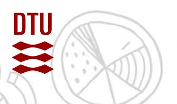
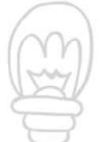
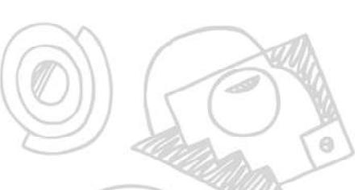

## **Description of innovation case**

Egholm A/S is a family-owned company located in Lemvig, founded in 1992. Originally, Egholm developed agricultural machines and implements, but today we specialize in the design and production of robust utility machines that keep urban spaces, parks, and outdoor areas clean and attractive. Egholm has sold machines to schools, hospitals, cemeteries, and other institutions in more than 130 countries. We have a strong focus on innovation, quality, and sustainability, and we are currently finalizing our first ESG report.
We design our machines and attachments in our own prototype workshop. Easy tool change and operator comfort are central to the development of our equipment, which can be divided into three main groups: green for lawn and turf work, black for cleaning tasks, and white for snow-clearing tasks.
We maintain a good and close dialogue with our existing customers, and we want to continue developing products that meet future needs and requirements. Today, most of our attachments are hydraulic and partly electric. Our ambition is for energy optimization to become the next generation of utility machines.
Many users of our utility machines carry out several tool changes during a working day, and some tasks are more energy-intensive than others. We want our products in the future to help them minimize the total energy consumption across a wide range of tasks as much as possible.

## **Innovation question**

How can we, through new technologies such as AI and machine learning, minimize the energy consumption of our utility machines?
Is it possible to incorporate some form of motivation for the user of the machines to use them in a way where they consumes the least amount of energy?
Name of company: Egholm
Contact person: Martin Wingaa
Email: mwi@egholm.dk Mobile: 40308964
Company website: www.egholm.eu

Engineering Technology Lautrupvang 15 2750 Ballerup

